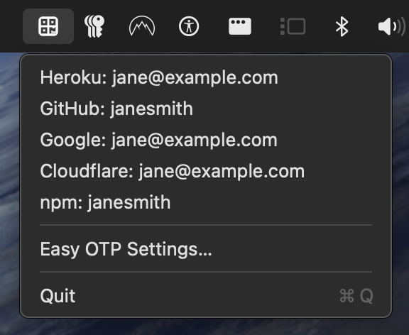
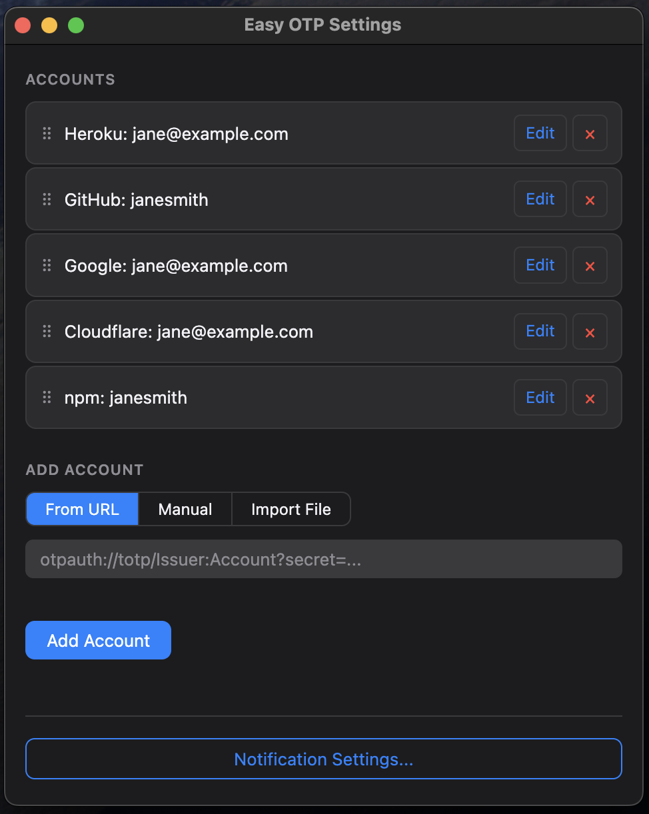

> [!WARNING]
> **This project is archived.** It's been replaced by [Menu OTP](https://github.com/iambriansreed/menu-otp), a native macOS version. New features and fixes land there.

# Easy OTP

A macOS menu bar app for managing TOTP (Time-based One-Time Password) accounts.

Click an account to copy its current OTP code to the clipboard.

Accounts can carry an optional icon — an emoji you pick, or a favicon looked up for you.
When you add an account without setting an emoji, Easy OTP guesses the issuer's domain
(appending `.com` when the issuer isn't already a domain) and asks DuckDuckGo's icon
service for it, falling back to Google's only when DuckDuckGo has nothing. Only the
guessed domain name is sent, never the account or secret. Use **Find Missing Icons** in
Settings to fill in accounts you added earlier, or **Find Favicon** on a single account to
retry after correcting its issuer.





## Download


[Download Easy OTP.dmg](https://github.com/iambriansreed/easy-otp/releases/latest)

Requires macOS. Since the app is unsigned, macOS will block it on first launch. To open it:

1. Right-click the app → **Open** → click **Open** in the dialog

If that doesn't work (macOS 15+):

2. Run this in Terminal:
    ```sh
    xattr -dr com.apple.quarantine "/Applications/Easy OTP.app"
    ```

## Build Locally

### Prerequisites

- macOS
- Node.js 22+

```sh
npm install
npm run make-icons
npm run build
```

Open `dist/Easy OTP-<version>-arm64.dmg` to install.

## Development

## Setup

```sh
npm install
```

## Icon

`build/` isn't committed, so `npm run make-icons` must run at least once before
`npm run pack` or `npm run build` — it generates `build/icon.icns` from `assets/icon.svg`
(requires macOS and `npm install`). Replace `assets/icon.svg` first to use your own icon.

```sh
npm run make-icons
```

## Development

```sh
npm start
```

Compiles TypeScript and launches the app via Electron. The tray icon will appear in your menu bar.

## Build

```sh
npm run pack   # builds a local .app (no installer, fastest for testing)
npm run build   # builds a distributable .dmg
```

Output goes to `dist/`.

## Accounts

Accounts are stored encrypted on disk using Electron's `safeStorage`. You manage them through the app itself.

### Adding accounts

From the menu bar → **Easy OTP Settings...** → Add Account. Two options:

- **From URL** — paste an `otpauth://totp/...` URI (e.g. from a QR code scanner)
- **Manual** — enter Issuer, Account, and Secret directly
- **Import File** — select a `.txt` file with one `otpauth://` URL per line

Importing merges with existing accounts. Accounts with the same `issuer` + `account` combination are updated in place.

### Editing & removing accounts

Open **Easy OTP Settings...** → click **Edit** on any account to update its fields, or **×** to delete it. Drag the handle on the left to reorder.

### Copying an OTP

Click any account in the menu bar to copy its current 6-digit TOTP code to the clipboard. The menu will show a confirmation before closing.

## Scripts

| Script               | Description                                                      |
| -------------------- | ---------------------------------------------------------------- |
| `npm start`          | Run in development mode                                          |
| `npm run pack`       | Build a local `.app` for testing                                 |
| `npm run build`      | Build a distributable `.dmg`                                     |
| `npm run make-icons` | _(Optional)_ Regenerate `build/icon.icns` from `assets/icon.svg` |
